# Hashtags for Humans

*???

Humans are pattern matching machines. The world around us is vast and incomprehensible, but we are able to make some sense of it by organizing messy reality into neat categories. We dismantle complex concepts and individuals into their constituent traits, to match them to prototypes, archetypes and stereotypes. 

Categories and hierarchies are built into our culture at the lowest levels: genders are baked into nouns and pronouns; family lineage -- literally, "the patriarchy" -- is written into our names. When we give names to abstract concepts; when we say these are dogs and these are rocks and these are songs, we are categorizing.

Given that this is a room full of programmers, I think you'll agree that the only thing we love more than making rules is making rules for making rules. So we make formal systems to manage our hierarchies.

---

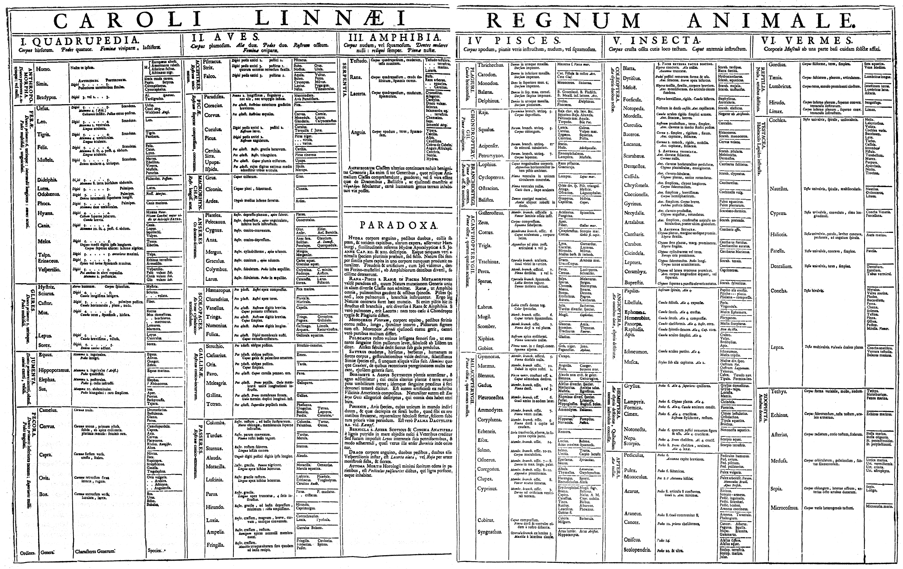
*???
These systems reflect the times in which they are created. Linnaeus' hierarchy of life -- kingdom phylum class order family genus species -- is an echo of king prince duke count baron knight peasant. What would a taxonomy look like if we created it today? Allow me to thought-lead for a moment:

---


*???
The information age promises the democratization and decentralization of media, with news and ideas and conversation spreading across the world in real time. Hierarchy and linear thought have no place in cyberspace. The world of information is coming in from every direction at once -- its a network where every node is connected. 

How do we organize knowledge in 2015? The hashtag.

---

## Definitions 
*???
First, let's get our terms straight. Many of us already have a pretty good idea of what a hashtag _is_, but I want to focus on what I consider to be the three essential properties of hashtags:

---

1. Hashtags are **relational**. An item in a collection can have multiple tags, and tags can have multiple items. Hashtag membership follows the same rules as mathematical sets.
--
2. Hashtags are **vernacular**. Any string can be a hashtag, and a hashtag's meaning comes entirely through usage. There is no authority that decides what a hashtag can be or what content can be tagged with it.
--
3. Hashtags are **conversations**. A hashtag isn't just collection; its a channel of communication. One *participates in* and *responds to* a hashtag. 

---

# Relational
*???
## History
Let's start with tags as a categorization system. The concepts of relational categorization predates the web and even computers by hundreds of years. I don't have time for quite that much background. Instead, let's go to the library.

---

*???
Libraries are kind of like an analog database, right? They contain information, and they organize it in a way that you can find it. But books take up physical space. A book needs to _be_ somewhere. If you have to put a book _somewhere_ its often helpful to put it with other books of the same kind -- then you don't need to know exactly where every book is, just how to find the category.

If you're the super-organized type, like I imagine most librarians are, you'd organize your categories into a hierarchy. At the top of the hierarchy you have broad classifications like science, philosophy, arts; below them you segment into finer-grained sections like geology, ethics, sculpture. You keep subdividing into smaller and smaller sections until you have the right place for everyhthing in your collection.

The problem with this is that you can only impose one hierarchy at a time; it must necessarily be compromised. If you want arts and technology to be top-level classifications, that means that architecture and structural engineering books could be on opposite sides of the library. What do you do with topics that don't fit into your hierarchy?
---
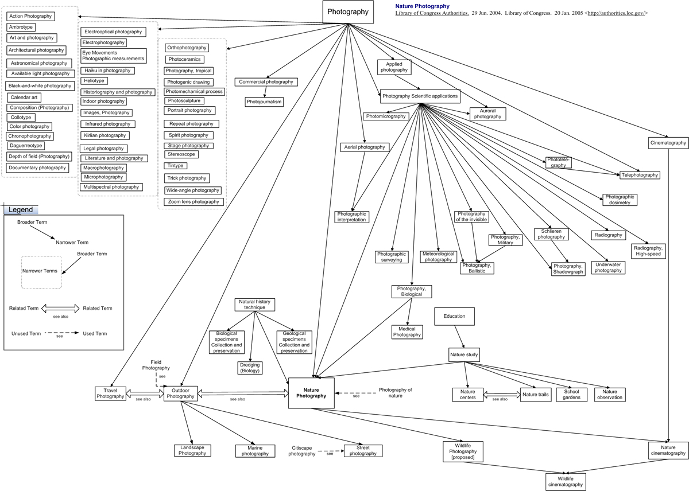
*???
You create a system of categorization on top of your hierarchy, with a vocabulary of keywords to mark attributes of the item that you couldn't express in the hierarchy. For example, the library of congress *classifications* is the hierarchy that dictates where books are located. The *subject headings* map topics to the different branches of the classifications hierarchy where that topic is discussed. 

<!-- TODO: aside on the expression problem -->

This indirection is a necessary inconvenience in a physical collection -- an item in that collection needs a canonical address to prevent duplication. But indirection is how everything works on a computer. Web developers don't need their data to be stored in a way that makes sense to them as long as it makes sense to the computer. In other words, we do not need to impose a hierarchy on our data if it doesn't make sense. 

Hierachies were designed to be searched by hand, and on foot; keywords are meant to be searched by computer.

---

## Demo
*???
So I've been talking about keywords and set theory in sort of abstract terms. Let's make it a little more concrete.

There's this children's game called Guess Who?, where players take turns asking yes-or-no questions about the characters, like "do they have brown hair?" or "are they wearing a hat?", in order to figure out who their opponent has picked. It's like 20 questions for people without imagination.

Well that's not fair. I thought this was trememdous fun in 1991. Plus I think I had a little crush on Maria. But the skills it taught me were how to judge people and how to do an advanced Google search. 

Effectively what you're doing in this game is filtering a dataset with a series of logical predicates `AND`ed together. 

This is how we could express this in javascript:

---
```
people.filter((p) => p.tags.blond && p.tags.male && p.tags.mustache)
```
*???

And this is one way to say that in SQL:
---
```
SELECT * 
FROM people 
WHERE tags LIKE "%blond%" 
AND tags LIKE "%male%" 
AND tags LIKE "%mustache%"
```
*???
I don't have enough screen space to show the version of this with JOINs.

---
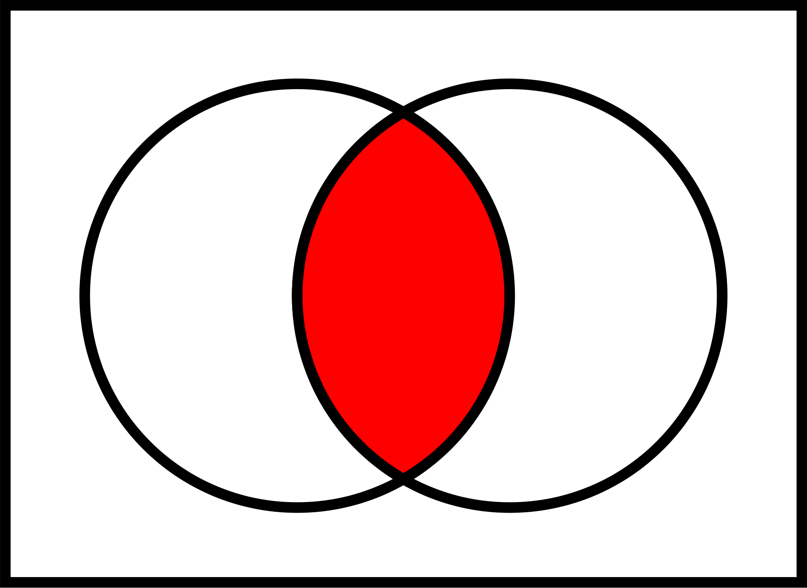
*???
Let's flip our perspective around and look at this from the trait's perspective instead of the person's. Before we would say that Anita, Charles, David and Joe all have blond hair; instead, we'll say the set of people with blond hair includes Anita, Charles, David and Joe. The set of people with glasses are Claire, Joe, Paul, and Tom. The *intersection* of blondes and people wearing glasses is Joe.

If you're anything like me you're probably thinking "this game needs more features". Its already based around logical `AND` -- let's add `OR` and `NOT`. That's just what I did. Now we can express complex, nested selections, like:

```
(and male 
     (or blond redhead) 
     (not mustache))
```

---
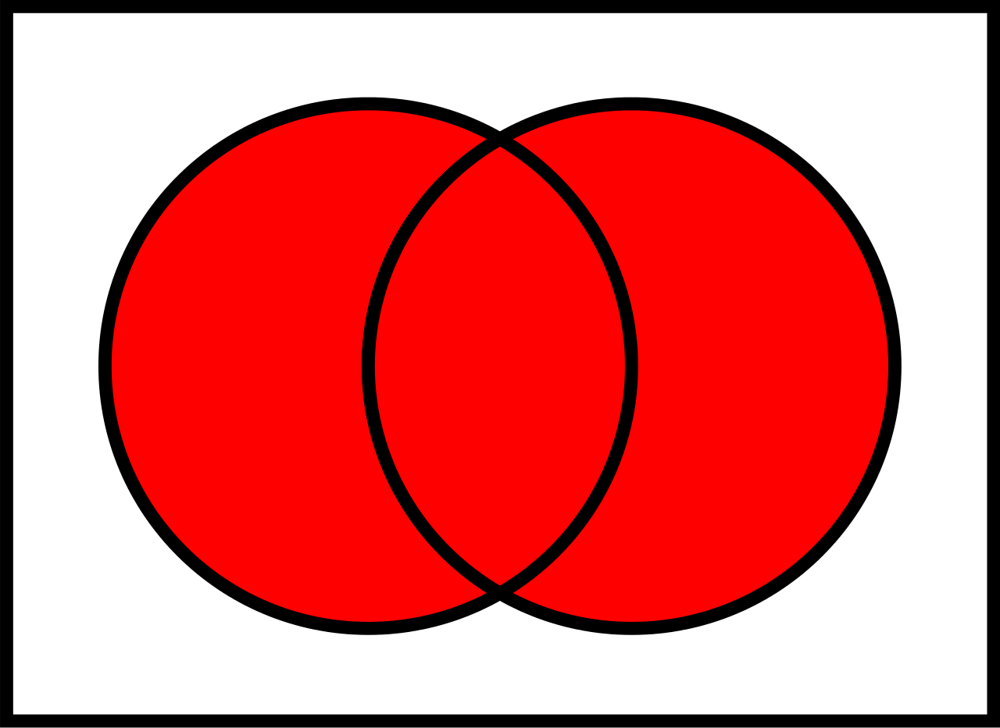
*???
There are set theory equivalences here, too: Unions  are both of the sets combined, both of the circles together. They correspond to logical `OR`. 

---
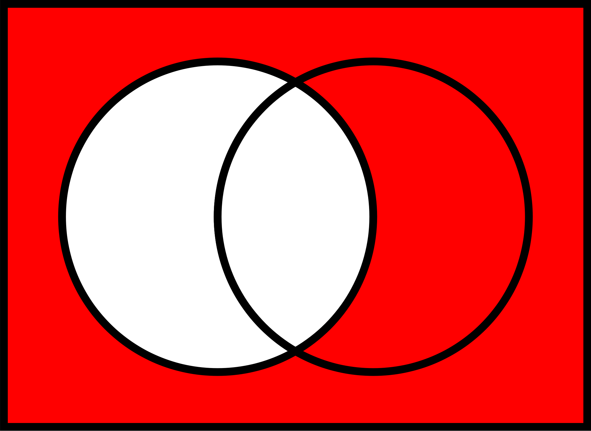
*???
And set complements, the area outside of the circles, correspond to logical `NOT`.

What does this have to do with hashtags or humans? Well, when we see tags in the wild, we tend to see them in clusters -- Twitter's length constraints prevent exhaustive tagging, but most sites do not, and posts will have many tags. Likewise, in many cases a tag will be associated with many posts. There's a many-to-many relationship between posts and tags. This is the same relationship model Guess Who? uses for people and their traits.
---

# Vernacular
*???
## History

Let's fast-forward a little bit to the early 2000s, the Web 2.0 Years. The internet had always been a social place on Usenet and BBSes, but the seeds of what we recognize as Social Media today were being sown. 

The library model doesn't quite work for the social web. In a typical library, the hierarchy and the keyword vocabulary are fixed, and the collection is curated by the librarians. A patron cannot add books to the collection, nor can they alter the classifications or keyword vocabulary.

---
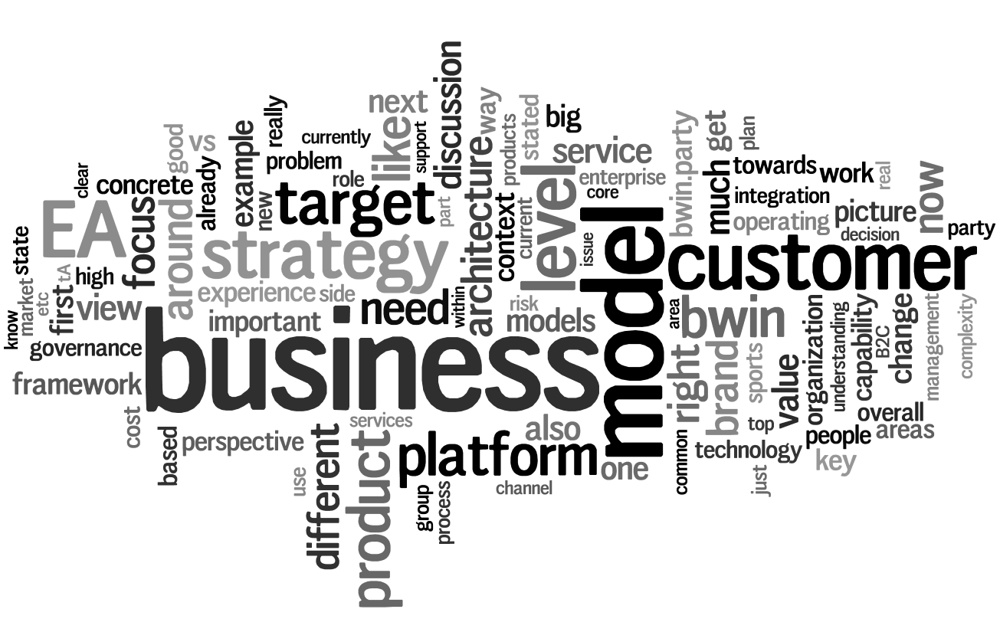
*???
But the photos on flickr, or the links on delicious belong to the community -- so why shouldn't the vocabulary of categorization also belong the them? And thus the rise of user-generated taxonomy, or "folksonomy", became one of the defining characteristics of the Web 2.0 Era. Not only had we democratized information, we had democratized the organization of information.

Also, we stopped calling them "keywords" -- probably because of shameful associations with AOL -- and started calling them tags.

## pros/cons of folksonomy
---

*???

Let's take a look at a typical metafilter post from 2002. This post was tagged #war #blog #blogs #warblog #warblogs and #TimCavanaugh; sometime later it was tagged with #brokenlink. First, let us admire the different kinds of information that the tags cover: tim cavanaugh is the author, and warblogs are the subject. #brokenlink is a site-wide convention for posts with broken links -- the tags on this post are used both for the content of the linked article and to describe the state of the link itself.

The freeform nature of tags let us categorize via neologisms -- "blog" first appeared in 1999 and "warblog" was coined *three months* before this post -- a decentralized vocabulary can include new concepts much more quickly than a centralized one. If we needed an approval committee for tag terms, warblogs would have become totally irrelevant by the time they were added to the tag vocbulary.

On the other hand, a centralized system can have rules for dealing with synonyms and inflections -- a controlled vocabulary, once it were able to reference blogs at all, wouldn't have distinct terms for #blog and #blogs. Nor does a controlled vocabulary have namespace collisions: posts tagged with #football will either be about soccer or hand-egg, but not both. A decentralized system can only hope its users figure out some conventions and choose to follow them.

## Dealing with downsides
### Parallel systems
---
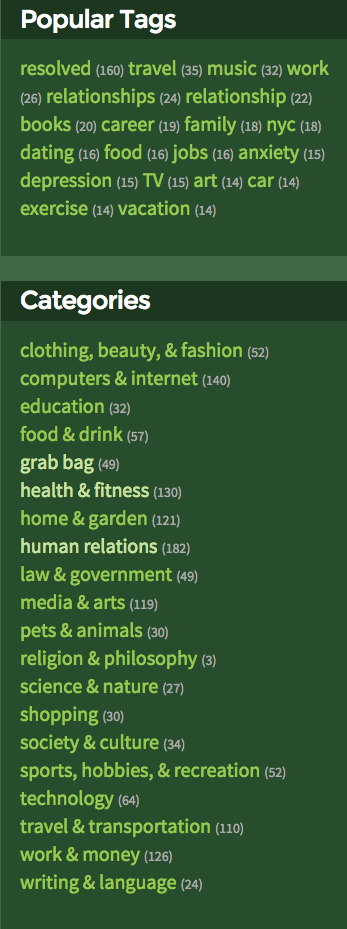
*???

One solution for this is an ontology that includes both a fixed vocabulary of categories, often mapping to classical hierarchies, and an open vocabulary of non-hierarchical tags. This is the approach that's used in wordpress blogs and ask metafilter questions. 

---
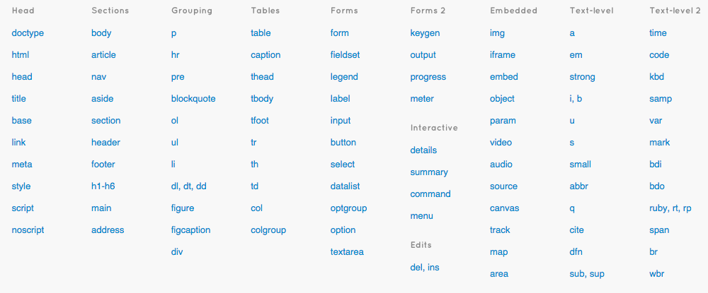

```
.actions
.active
.app-logo
.app-message
.app-toggle
.app-toggle__wrap
.apply
.axis-label
.axis-x-label
.back
.bar-name
.bar-top-label
.bar-value
.bars-wrapper
```
*???

This is also the approach taken by browsers. We have a fixed vocabulary of general-purpose tags -- some of them have special functionality but most of them are just common classifictions of containers. But we can also create our own terms with meaning specific to the site. Every element on the page must have one and only tag type, but they can have as few or as many classes as they want. 

### Autocomplete tags
Another common solution is to have user-defined tags as the sole form of taxonomy, but encourage users, through the UI, to prefer existing terms over novel ones. This is the preferred system for newer networks that do not have distinct categories and tags, like twitter and tumblr. 

There's one particular use of this that I want to explore in depth: Facebook's gender selector. Before this came out, most of the gender options I had seen were either strictly male/female or freeform text fields. A few offered more choices.

---
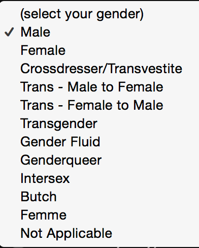
*???

This particularly progressive social networking site offered these options for gender. This is a lot of options, but it reveals a paradox: the more options you provide, the more you appear to be excluding -- if genderqueer can make the list, why not pangender? Why should use a term that's pretty close in definition but uses terms that make me uncomfortable? 

It's kind of a mess from a UI perspective, too -- there are a lot of items and they don't seem to be in any particular order. There are a couple of redundant or ambiguous items that would be a lot more straightforward if you could combine terms. 

---
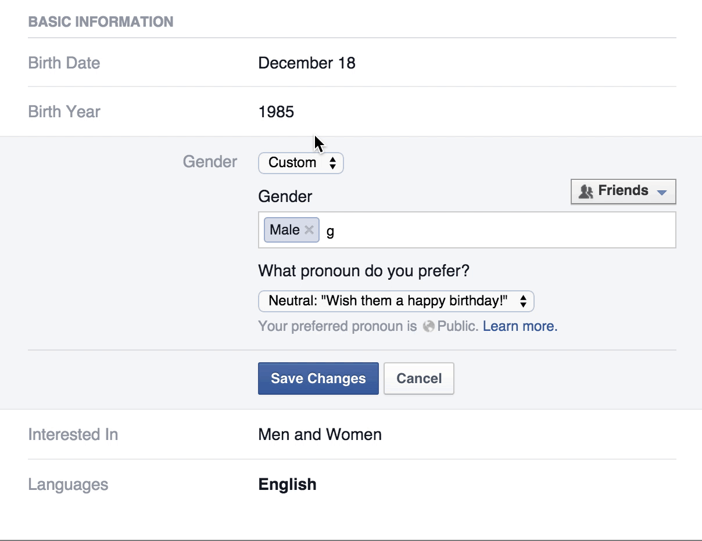
*???

But when Facebook adopted the tag-based gender options, they didn't just drop in a jQuery library and call it a day; there are specific design choices being made in this form. Here are a few of them:

- It cannot be empty. You have to select at least one option, though that option may be one of several variations on genderless
- While most tag fields are abstract and can end up like junk drawers for metadata, tags in the gender field have inherent context, even if the meaning is not known.
- The form reflects the subject matter: gender is simple for many, but complex for others. Therefore it has multiple tiers of defaults: male / female, known tags, and freeform tags.
- it has a separate (limited option) selector for pronouns -- this is the only part that has any implications for the UI.
- There are a lot of options that seem to be redundant. This is intentional. These tags are being used for *personal expression* as much as they are for selection 
- it wasn't initially freeform; that was added later. It launched with over 50 gender options but even that was not sufficient. 50 is more than enough options for many people, but its quite limited if you're thinking of it as the vocabulary for expressing the nuance of how one exactly relates to society's expectations of masculinity and femininity.

### Restricting tags
A third approach is that you can use human moderators to enforce community standards. One can do this with a hired staff, but in many cases its more efficient to harness the internet's limitless supply of pedantry and deputize users as moderators.

We'll take it as given that community management is necessary for dealing with spam and trolls. Sites like Instagram that have policies against nudity and illegal activity blacklist tags like #pussy and #weed from search results. (They also blocked the eggplant and peach emojis for similar reasons.) Things get a little more complicated when you regulate for quality.

---
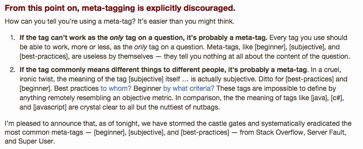
*???

Knowledge bases like stack overflow and wikipedia depend on their posts being well organized for both editors and readers, and managing metadata is as much a part of that as managing content. Editorial policy isn't just normalizing #blogs and #blogging to #blog, it also involves choosing what information is purposefully not captured. This post is discussing why qualitative tags like #best-practices don't fit the mission of stack overflow, and why they have been removed. They're not imposing a system as rigid as a formally defined vocabulary, but they're far from the anarchy of pure folksonomy. These sites compromise expressivity to provide more important features.

But in many cases freedom of expression is the feature. Twitter could do a lot to improve the quality of discourse on its service but removing subjective hashtags ain't it. The restrictions that are useful for a purpose-made knowledge base are detrimental to a general means of communication.

---
# channels
*???
## history

---
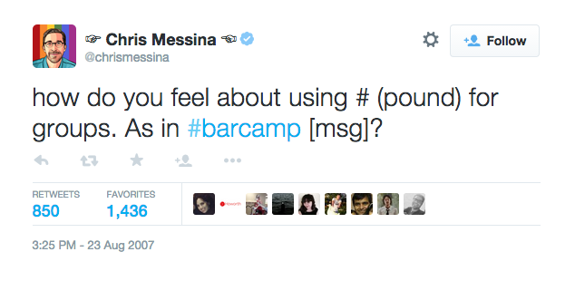
*???

We've gotten this far and we still haven't answered the biggest question of them all: how did the hashtag get its hash? Here's the TL;DR:

---
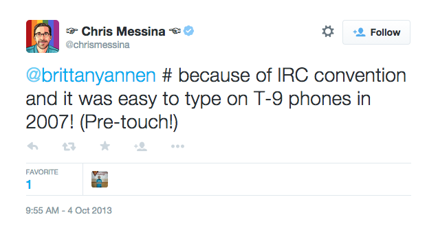
*???

A little background: IRC is a decentralized chatroom protocol that predates the web. The rooms are called channels and public channels are marked with a hash symbol; on many servers any user can create a channel. Channels _are_ a form of categorization, but channels are intended to be a single, long-running discussion with real-time participation. 

IRC channels are vernacular and conversational, but they are not relational; there is no system for cross-referencing. Messages can be cross-posted but this creates unconnected copies. On many IRC servers cross-posting is a bannable offense. 

In 2006, prior to the first twitter hashtags, Jaiku, a now-forgotten microblogging system allowed you to message groups by starting a post with a hashtagged group name. If the group didn't already exist, this would create it. This was still more channel-oriented than tag-oriented; you were messaging the group as you would message another user; you couldn't "mention" multiple groups. Tagged messages would go into a channel *instead of* the main feed.

When hashtags came to Twitter, there was no native support for this sort of thing. Much like mentions and retweets, they began as conventions that would only later be proper features. This meant that early hashtags functioned like keywords for twitter's existing search system, which was completely agnostic towards search terms. 

---
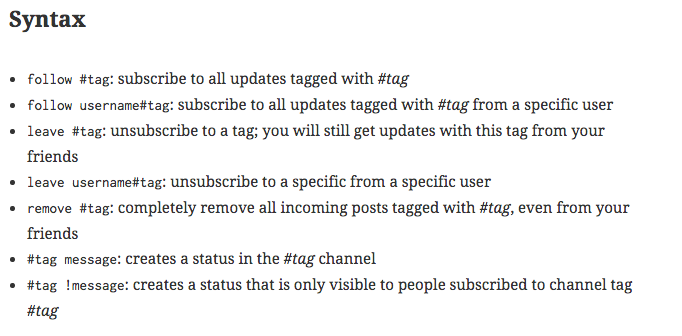
*???

There was a whole syntax for messaging and subscribing to tags proposed, but it was never implemented; nor did twitter ever distinguish between posts starting with tags vs those containing them, as they would with replies and mentions.

Twitter's benign neglect allowed the hashtag to adapt to the unique nature of the network: becauseTwitter combines the real-time conversational aspects of IRC with the authorial collection aspects of blogging, it needs systems for both grouping conversations into a channel and tagging posts with metadata. Hashtags combined these features into a single idiom and acheived both.

A hashtag is more than the sum of its tweets. Tags at their best (and their worst) are entities in their own right -- there is as meaning in the connections as there is in the content. People talk about "posting in this tag" and tell each other to "get out of this tag" because tags are shared spaces, and tagging is inherently a group participation. Unless you take pains to identify the tag without naming it, eg:

---
# 👾🐊
*???

commentary and discussion about a tag also becomes part of the tag.

---
# Conclusions
*???

When the digerati of 2007 were first exploring the modering hashtag, there was an understanding that it wasn't going to be limited to any single site. This was the heady days of microformats and the semantic web; my forebears in thought-leadership had dreams of tags providing the metadata to unify human and machine interfaces across the whole internet.

## Vernacular

---

*???

That's not quite how it worked out. Hashtags couldn't live up to their utopian vision, but they've become much more a part of society than they could have imagined. Tags are not only a means of conversation but now also _part of_ conversation. 

---
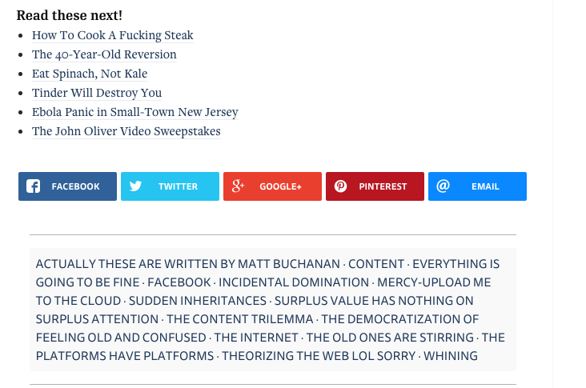
*???

Because there are no _rules_ for tags, our usage can reflect all kinds of purposes -- we develop idioms for hashtags. They're used as interjections, parenthetical asides, and as a means to #mock the #overuse of #hashtags.

## Conversational

This is all powered by the duality of hashtags as a collection of ideas and the channel for broadcasting them. I would bet that very few of us participate in any hashtags on a daily basis, but everyone here is familiar with them as a presence in society. (If not, the last 15 minutes have probably been very confusing.)

---
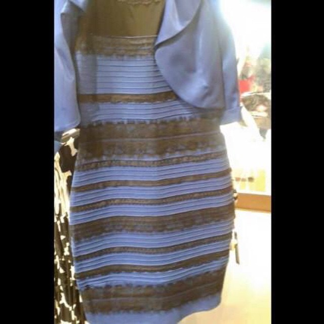
*???
Tags can be trite.
---
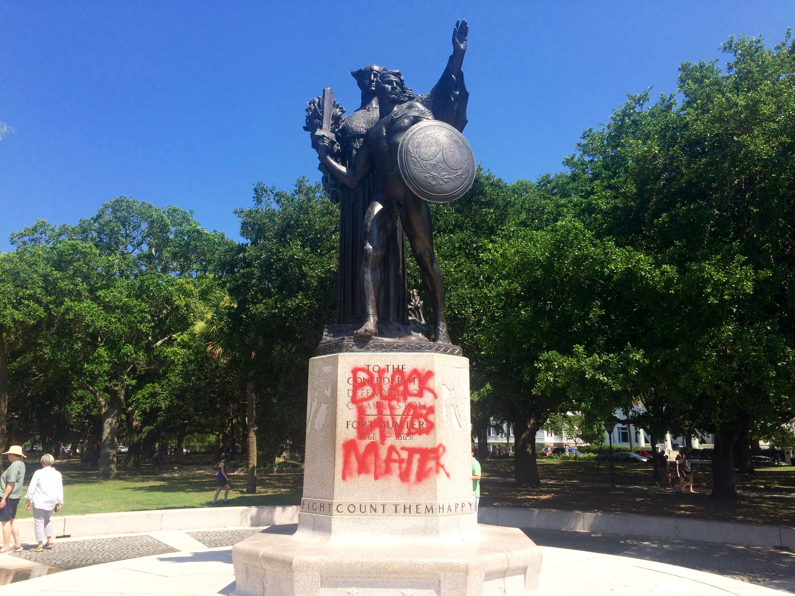
*???
Tags can be meaningful.

But in either case, tags are more than their content and more than their context. Tags can be the signifier for massive social movements, whether they be 24 hours of civilization-paralyzing mania or something that, you know, matters. 

---
*???

## Relational

For all the ways that tags can unite people around a common idea, they're not an unmitigated force for good. Any woman on the internet can tell you that. 

But lets go back to the beginning. Humans are pattern-matching machines.  The world around us is vast and incomprehensible, but we are able to make some sense of it by organizing messy reality into neat categories.

In order to do this, in order to make sense of the world, we need to have a system of categorization that works for the world we're in. And the systems of hierarchy and clustering that we're relying on now are insufficient. 

We've always intuitively understood tags and traits -- children don't have to be taught how to read the Guess Who? people's faces. But hashtags give us a more structured system of organization that maps pretty well to naive set theory. They provide a framework for thinking about ideas like intersectionality -- that race and gender aren't just single values but complex constellations of interrelated attributes and experiences. 

## The Future

And what about kids growing up in a world where tags have always been the predominant paradigm? Will they leave us hierarchy-thinkers behind? Is this like the last chapter of Childhood's End; should this talk be called Hashtags for Posthumans?

It's fashionable to mock people who use the idioms of hashtags to define themselves. I will admit that I don't especially understand it myself; part of why I did this talk was to try to understand it. But I look back on myself at that age and I think of all the ways I felt weird and gross and worst of all, alone in my weird grossness. As an adult I can think a little more clearly about myself without labels but man, I sure wish I had some labels that made sense for my version of gender and my version of sexuality. I know I'm not alone; there are a lot of people who have rounded up to straight, or male, or to any sort of identity because they thought they had to pick one-and-only-one from the standard list.  

So in a lot of ways, I envy the generation that's growing up in a tagged world. Now, I may be a thought leader but I'm not an idiot -- Hashtags will not save the world. But the dream of the internet is a place where people all over the world can meet others that share their esoteric interests while also exchanging new ideas. As asinine as this sounds, hashtags give us both a way to conceptualize this and a way to make it happen, and I'm feeling optimistic. 
